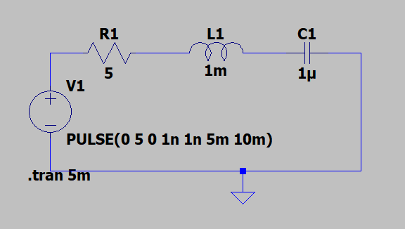

# The RLC Circuit: A Physical Analog Computer

This project explores how a simple electronic circuit—the RLC circuit—inherently solves a second-order ordinary differential equation through its physical properties. It demonstrates the concept of analog computing, where a physical system's behavior is a direct analog to a mathematical equation, requiring no digital processor or stored instructions.

## 1. The Physical System

The system is a series RLC circuit, consisting of three fundamental passive components connected to a voltage source `V(t)`:
-   A **Resistor (R)**
-   An **Inductor (L)**
-   A **Capacitor (C)**

*(**Action:** Replace this line with a screenshot of your LTspice schematic, like the one you uploaded)*

## 2. The Inherent Differential Equation

The behavior of this circuit is governed by Kirchhoff's Voltage Law, which states that the sum of the voltage drops across the components equals the source voltage. The voltage across each component is defined by its physical relationship with the current `I(t)`:

-   Resistor: `VR = I * R`
-   Inductor: `VL = L * dI/dt`
-   Capacitor: `VC = (1/C) * ∫I dt`

Summing these gives the integro-differential equation for the circuit. By differentiating this with respect to time, we arrive at the **second-order linear ordinary differential equation** that the circuit's physics must obey at all times:

    d²I(t)/dt² + (R/L)*dI(t)/dt + (1/LC)*I(t) = (1/L)*dV(t)/dt

## 3. How the Circuit "Computes"

A digital computer solves this equation by executing millions of discrete numerical instructions. The RLC circuit, however, computes the solution instantly and continuously through its physical nature.

-   **The "Program":** The physical values chosen for `R`, `L`, and `C` act as the fixed coefficients of the differential equation.
-   **The "Input":** The input is the time-varying voltage source `V(t)`. In this simulation, we use a pulse to "kick" the circuit into action.
-   **The "Computation":** The laws of electromagnetism force the electrons within the circuit to flow in a pattern `I(t)` that simultaneously satisfies the physical constraints of all three components. This physical equilibrium *is* the solution.
-   **The "Output":** The solution to the differential equation is the resulting current waveform `I(t)` over time.

## 4. LTspice Simulation and Results

Running a transient (`.tran`) simulation in LTspice allows us to observe the solution directly. The resulting plot for the current `I(t)` is a classic **damped sine wave**.

*(**Action:** Replace this line with the screenshot of your LTspice plot, like the one you uploaded)*

This waveform represents the physical behavior of the system:
-   **Oscillation (the "sine" part):** Energy sloshes back and forth between the capacitor's electric field and the inductor's magnetic field.
-   **Damping (the "decay" part):** The resistor dissipates this energy as heat, causing the oscillations to die out until the circuit reaches a stable state.

This directly observable waveform is the real-time, physical solution to the differential equation, computed not by code, but by physics.