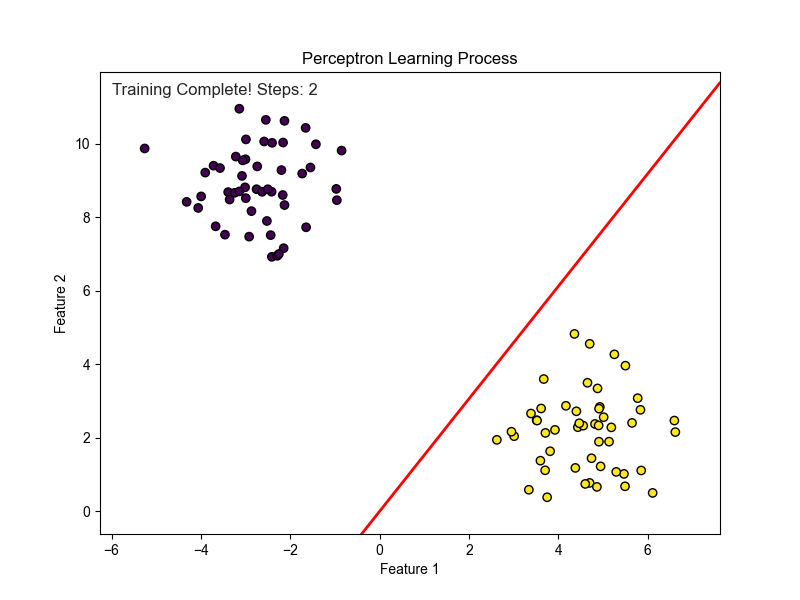

# Animated Perceptron Learning Visualization

This project provides an animated visualization of the Perceptron learning algorithm, one of the simplest types of artificial neural networks. The Python script generates a 2D linearly separable dataset and trains a Perceptron to find a decision boundary that correctly classifies the data.

The animation shows the learning process in real-time, illustrating how the neuron's "line" (the decision boundary) adjusts its position with each weight update until the two data classes are perfectly separated.



## How It Works

1.  **Perceptron Class**: A simple Perceptron classifier is implemented from scratch. It uses the Heaviside step function as its activation function.
2.  **Data Generation**: The `sklearn.datasets.make_blobs` function is used to create two distinct clusters of data points in a 2D plane.
3.  **Training and Visualization**:
    - The `fit` method of the Perceptron is implemented as a Python generator. It `yields` control after every single weight update.
    - `matplotlib.animation.FuncAnimation` is used to create the animation. The `update` function for the animation calls the training generator, gets the latest weights, and redraws the decision boundary line on the plot.
    - This process continues until the Perceptron finds a line that separates the data (convergence) or the maximum number of iterations is reached.

## Prerequisites

To run this script, you will need Python 3 and the following libraries installed:
-   NumPy
-   Matplotlib
-   scikit-learn

You can install them using pip:
```bash
pip install numpy matplotlib scikit-learn